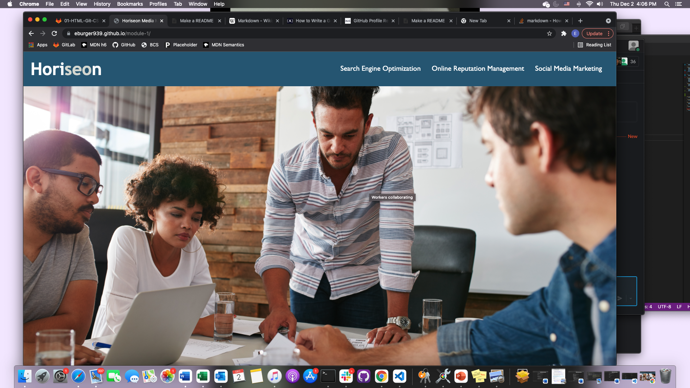

# Homework 1
* Due on 12/2/2021

##### Description
* The purpose of this assignment was to replace div sections with semantic html elements to make the webpage more accessible.  Image descriptions were added to all icons and images, and the CSS code was consolidated and streamlined.  

##### Screen shot of final depolyed webpage

##### Link to deployed application
* https://eburger939.github.io/module-1/
